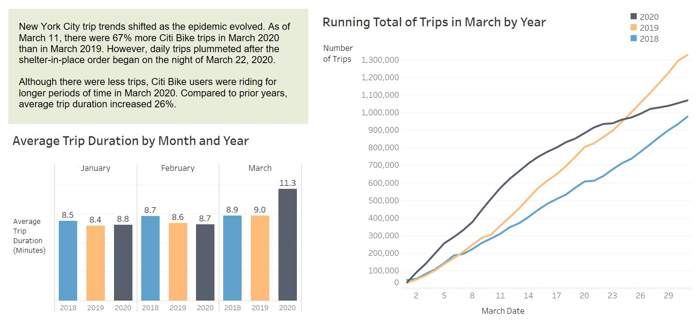
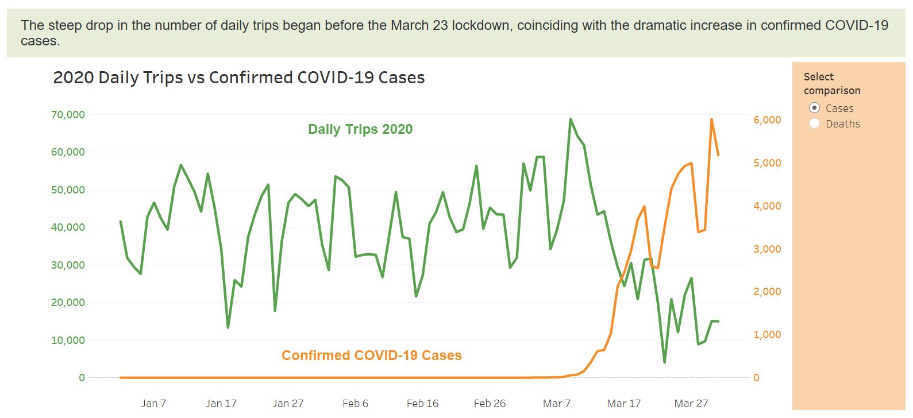
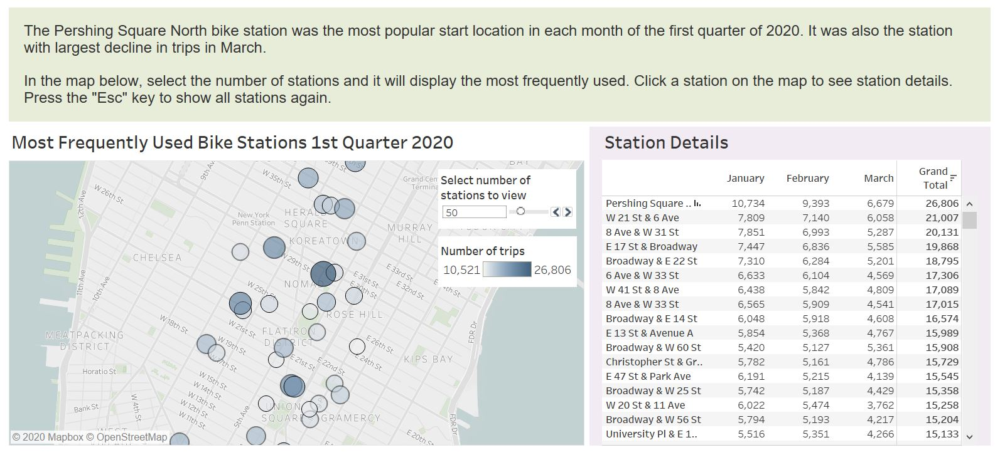

# The Impact of the COVID-19 Pandemic on Citi Bike Trips in New York City 

View the Tableau Public dashboard: 
https://public.tableau.com/profile/scott.clark2341#!/vizhome/CitiBike2020/COVID-19Story 

### Context

This analysis looks at the early impacts of the COVID-19 pandemic on Citi Bike trips within New York City, based the data available as of May 11, 2020.

Citi Bike is a privately owned public bicycle sharing system that serves New York City. It is the largest bicycle sharing program in the United States, averaging more than 50,000 trips per day. Citi Bike regularly publishes program statistics on its open data portal.

On March 1, 2020, New York City announced its first case of COVID-19, the severe acute respiratory syndrome spreading around the world. In order to reduce the spread of the disease, New York Governor Andrew Cuomo issued a statewide stay-in-place order that began the night of March 22. Only essential businesses were allowed to remain open. Citi Bike bicycles continued to be available to the public. 

### Visualizations incorporate:
- Large datasets (1.6 GB, 9.2 million rows)
- Blended datasets from different sources
- Unioned sheets
- Parameter switches to control chart display and text
- Linked cross-table filters
- Customized tooltips
- Calculated fields
- Map layers
- Chart with synchronized dual axis
- Horizontal Y axis labels (work around for a well-known Tableau limitation)

### Data Sources
- Citi Bike System Data: https://www.citibikenyc.com/system-data
- New York City Health Department: https://www1.nyc.gov/site/doh/covid/covid-19-data.page

### Visualizations
Visit Tableau Public for interactive versions: https://public.tableau.com/profile/scott.clark2341#!/vizhome/CitiBike2020/COVID-19Story

